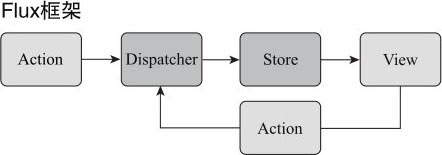

一个Flux应用包含四个部分:

* Dispatcher，处理动作分发，维持 Store 之间的依赖关系；
* Store，负责存储数据和处理数据相关逻辑；
* Action，驱动 Dispatcher 的 JavaScript 对象；
* View，视图部分，负责显示用户界面。

如果非要把 Flux 和 MVC 做一个结构对比，那么，Flux 的 Dispatcher 相当于 MVC 的 Controller, Flux的Store 相当于 MVC的Model, Flux 的 View 当然就对应 MVC 的 View 了，至于多出来的这个 Action，可以理解为对应给 MVC 框架的用户请求。